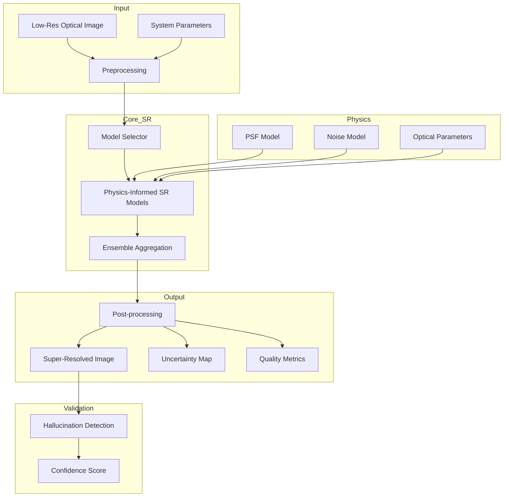

# ARCHITECTURE.md

## Semiconductor Super-Resolution System Architecture

### Version 1.0.0 | Last Updated: 2025

---

## Table of Contents

1. [System Overview](#1-system-overview)
2. [Core Components](#2-core-components)
3. [Model Architectures](#3-model-architectures)
4. [Physics-Informed Components](#4-physics-informed-components)
5. [Data Pipeline Architecture](#5-data-pipeline-architecture)
6. [Training Infrastructure](#6-training-infrastructure)
7. [Evaluation Framework](#7-evaluation-framework)
8. [Deployment Architecture](#8-deployment-architecture)
9. [API Design](#9-api-design)
10. [Performance Optimization](#10-performance-optimization)

---

## 1. System Overview

### 1.1 High-Level Architecture



### 1.2 Design Principles

- **Modularity**: Swappable components for models, losses, and metrics
- **Physics-Grounded**: Optical physics embedded in architecture and training
- **Uncertainty-Aware**: Confidence estimation for every prediction
- **Production-Ready**: Optimized for deployment with ONNX/TensorRT
- **Reproducible**: Deterministic training with seed control
- **Scalable**: Multi-GPU training and inference support

### 1.3 Technology Stack

```yaml
Core Framework:
  - PyTorch 2.1.0
  - CUDA 11.8 / 12.1
  - Python 3.10+

Key Libraries:
  - torchvision 0.16.0
  - timm 0.9.x (Vision Transformers)
  - opencv-python 4.8.x
  - scipy 1.11.x
  - scikit-image 0.22.x

Optimization:
  - ONNX Runtime 1.16.x
  - TensorRT 8.6.x
  - PyTorch JIT Compiler

Experiment Tracking:
  - Weights & Biases
  - TensorBoard
  - MLflow (optional)
```

---

## 2. Core Components

### 2.1 Component Diagram

```python
# Core System Components
semicon-super-resolution/
├── models/                 # SR model implementations
│   ├── base.py            # Abstract base classes
│   ├── unet.py            # U-Net variants
│   ├── rcan.py            # Residual Channel Attention
│   ├── esrgan.py          # Enhanced SRGAN
│   ├── swinir.py          # Swin Transformer IR
│   ├── realesrgan.py      # Real-ESRGAN
│   └── hat.py             # Hybrid Attention Transformer
├── physics/                # Physics-informed components
│   ├── psf.py             # Point Spread Function
│   ├── otf.py             # Optical Transfer Function
│   ├── degradation.py     # Physical degradation models
│   └── constraints.py     # Physics constraints
├── data/                   # Data pipeline
│   ├── dataset.py         # Dataset classes
│   ├── transforms.py      # Augmentation & preprocessing
│   ├── synthetic.py       # Synthetic data generation
│   └── loader.py          # Efficient data loading
├── training/               # Training infrastructure
│   ├── trainer.py         # Main training loop
│   ├── losses.py          # Loss functions
│   ├── optimizers.py      # Custom optimizers
│   └── schedulers.py      # Learning rate schedules
├── evaluation/             # Evaluation framework
│   ├── metrics.py         # Quality metrics
│   ├── semiconductor.py   # Domain-specific metrics
│   └── visualization.py   # Result visualization
└── deployment/             # Production deployment
    ├── export.py          # Model export (ONNX, TorchScript)
    ├── inference.py       # Inference pipeline
    ├── server.py          # REST API server
    └── optimization.py    # Runtime optimization
```

### 2.2 Base Model Interface

```python
from abc import ABC, abstractmethod
import torch
import torch.nn as nn
from typing import Dict, Tuple, Optional

class BaseSRModel(nn.Module, ABC):
    """Abstract base class for all super-resolution models"""
    
    def __init__(self, 
                 scale_factor: int = 4,
                 in_channels: int = 1,
                 out_channels: int = 1,
                 physics_aware: bool = True):
        super().__init__()
        self.scale_factor = scale_factor
        self.in_channels = in_channels
        self.out_channels = out_channels
        self.physics_aware = physics_aware
        
    @abstractmethod
    def forward(self, 
                x: torch.Tensor, 
                optical_params: Optional[Dict] = None) -> Tuple[torch.Tensor, Optional[torch.Tensor]]:
        """
        Forward pass
        Args:
            x: Input low-resolution image [B, C, H, W]
            optical_params: Optional optical system parameters
        Returns:
            sr_image: Super-resolved image [B, C, H*s, W*s]
            uncertainty: Optional uncertainty map [B, 1, H*s, W*s]
        """
        pass
    
    @abstractmethod
    def get_model_complexity(self) -> Dict[str, float]:
        """Return model complexity metrics (FLOPs, parameters, etc.)"""
        pass
```

---

## 3. Model Architectures

### 3.1 Physics-Informed U-Net

```python
class PhysicsUNet(BaseSRModel):
    """U-Net with embedded optical physics"""
    
    def __init__(self, 
                 scale_factor: int = 4,
                 base_channels: int = 64,
                 psf_kernel_size: int = 33):
        super().__init__(scale_factor=scale_factor)
        
        # Encoder path
        self.encoder = nn.ModuleList([
            ConvBlock(1, base_channels, stride=1),
            ConvBlock(base_channels, base_channels*2, stride=2),
            ConvBlock(base_channels*2, base_channels*4, stride=2),
            ConvBlock(base_channels*4, base_channels*8, stride=2),
        ])
        
        # Physics branch - learnable PSF deconvolution
        self.psf_branch = PhysicsBlock(psf_kernel_size)
        
        # Bottleneck
        self.bottleneck = ResidualBlock(base_channels*8 + 32)  # +32 from physics
        
        # Decoder path with skip connections
        self.decoder = nn.ModuleList([
            UpConvBlock(base_channels*8, base_channels*4),
            UpConvBlock(base_channels*4, base_channels*2),
            UpConvBlock(base_channels*2, base_channels),
            UpConvBlock(base_channels, base_channels//2),
        ])
        
        # Super-resolution head
        self.sr_head = PixelShuffle(scale_factor, base_channels//2)
        
        # Uncertainty head
        self.uncertainty_head = nn.Conv2d(base_channels//2, 1, 1)
        
    def forward(self, x, optical_params=None):
        # Physics features
        physics_feat = self.psf_branch(x, optical_params)
        
        # Encoder
        enc_features = []
        feat = x
        for encoder in self.encoder:
            feat = encoder(feat)
            enc_features.append(feat)
        
        # Combine with physics
        feat = torch.cat([feat, physics_feat], dim=1)
        feat = self.bottleneck(feat)
        
        # Decoder with skip connections
        for i, decoder in enumerate(self.decoder):
            feat = decoder(feat)
            if i < len(enc_features):
                feat = feat + enc_features[-(i+1)]  # Skip connection
        
        # Generate outputs
        sr = self.sr_head(feat)
        uncertainty = torch.sigmoid(self.uncertainty_head(feat))
        
        return sr, uncertainty
```

### 3.2 Residual Channel Attention Network (RCAN)

```python
class RCAN(BaseSRModel):
    """Residual Channel Attention Network for SR"""
    
    def __init__(self,
                 scale_factor: int = 4,
                 n_resgroups: int = 10,
                 n_resblocks: int = 20,
                 n_feats: int = 64,
                 reduction: int = 16):
        super().__init__(scale_factor=scale_factor)
        
        # Shallow feature extraction
        self.head = nn.Conv2d(1, n_feats, 3, padding=1)
        
        # Residual groups with channel attention
        self.body = nn.Sequential(*[
            ResidualGroup(n_feats, n_resblocks, reduction)
            for _ in range(n_resgroups)
        ])
        
        # Global residual connection
        self.global_residual = nn.Conv2d(n_feats, n_feats, 3, padding=1)
        
        # Upsampling
        self.upscale = nn.Sequential(
            Upsampler(scale_factor, n_feats),
            nn.Conv2d(n_feats, 1, 3, padding=1)
        )
        
    def forward(self, x, optical_params=None):
        # Extract features
        feat = self.head(x)
        res = feat
        
        # Deep feature extraction with attention
        feat = self.body(feat)
        feat = self.global_residual(feat)
        feat += res  # Global skip connection
        
        # Upscale to HR
        sr = self.upscale(feat)
        
        return sr, None

class ChannelAttention(nn.Module):
    """Channel attention mechanism"""
    
    def __init__(self, n_feats: int, reduction: int = 16):
        super().__init__()
        self.avg_pool = nn.AdaptiveAvgPool2d(1)
        self.conv_du = nn.Sequential(
            nn.Conv2d(n_feats, n_feats // reduction, 1),
            nn.ReLU(inplace=True),
            nn.Conv2d(n_feats // reduction, n_feats, 1),
            nn.Sigmoid()
        )
        
    def forward(self, x):
        y = self.avg_pool(x)
        y = self.conv_du(y)
        return x * y
```

### 3.3 SwinIR - Swin Transformer for Image Restoration

```python
class SwinIR(BaseSRModel):
    """Swin Transformer-based Image Restoration"""
    
    def __init__(self,
                 scale_factor: int = 4,
                 img_size: int = 64,
                 patch_size: int = 1,
                 embed_dim: int = 180,
                 depths: list = [6, 6, 6, 6],
                 num_heads: list = [6, 6, 6, 6],
                 window_size: int = 8):
        super().__init__(scale_factor=scale_factor)
        
        # Patch embedding
        self.patch_embed = PatchEmbed(patch_size, 1, embed_dim)
        
        # Swin Transformer blocks
        self.layers = nn.ModuleList()
        for i, (depth, n_head) in enumerate(zip(depths, num_heads)):
            layer = SwinTransformerBlock(
                dim=embed_dim,
                depth=depth,
                num_heads=n_head,
                window_size=window_size,
                shift_size=0 if i % 2 == 0 else window_size // 2
            )
            self.layers.append(layer)
        
        # Reconstruction
        self.reconstruction = nn.Sequential(
            nn.Conv2d(embed_dim, embed_dim * (scale_factor ** 2), 3, padding=1),
            PixelShuffle(scale_factor),
            nn.Conv2d(embed_dim // 4, 1, 3, padding=1)
        )
        
    def forward(self, x, optical_params=None):
        # Embed patches
        feat = self.patch_embed(x)
        
        # Apply Swin Transformer blocks
        for layer in self.layers:
            feat = layer(feat)
        
        # Reconstruct HR image
        sr = self.reconstruction(feat)
        
        return sr, None

class WindowAttention(nn.Module):
    """Window-based multi-head self attention"""
    
    def __init__(self, dim: int, window_size: int, num_heads: int):
        super().__init__()
        self.dim = dim
        self.window_size = window_size
        self.num_heads = num_heads
        self.scale = (dim // num_heads) ** -0.5
        
        # Define relative position bias
        self.relative_position_bias_table = nn.Parameter(
            torch.zeros((2 * window_size - 1) * (2 * window_size - 1), num_heads)
        )
        
        self.qkv = nn.Linear(dim, dim * 3)
        self.proj = nn.Linear(dim, dim)
        self.softmax = nn.Softmax(dim=-1)
        
    def forward(self, x, mask=None):
        B_, N, C = x.shape
        qkv = self.qkv(x).reshape(B_, N, 3, self.num_heads, C // self.num_heads)
        q, k, v = qkv.permute(2, 0, 3, 1, 4)
        
        q = q * self.scale
        attn = (q @ k.transpose(-2, -1))
        
        # Add relative position bias
        attn = attn + self.relative_position_bias
        
        if mask is not None:
            attn = attn.masked_fill(mask == 0, -100.0)
        
        attn = self.softmax(attn)
        x = (attn @ v).transpose(1, 2).reshape(B_, N, C)
        x = self.proj(x)
        
        return x
```

### 3.4 ESRGAN - Enhanced Super-Resolution GAN

```python
class ESRGAN(BaseSRModel):
    """Enhanced Super-Resolution Generative Adversarial Network"""
    
    def __init__(self,
                 scale_factor: int = 4,
                 n_feats: int = 64,
                 n_blocks: int = 23):
        super().__init__(scale_factor=scale_factor)
        
        # Generator architecture
        self.conv_first = nn.Conv2d(1, n_feats, 3, padding=1)
        
        # Residual in Residual Dense Blocks (RRDB)
        self.rrdb_blocks = nn.Sequential(*[
            RRDB(n_feats) for _ in range(n_blocks)
        ])
        
        self.conv_body = nn.Conv2d(n_feats, n_feats, 3, padding=1)
        
        # Upsampling
        self.upconv1 = nn.Conv2d(n_feats, n_feats * 4, 3, padding=1)
        self.pixel_shuffle1 = nn.PixelShuffle(2)
        
        if scale_factor == 4:
            self.upconv2 = nn.Conv2d(n_feats, n_feats * 4, 3, padding=1)
            self.pixel_shuffle2 = nn.PixelShuffle(2)
        
        self.conv_hr = nn.Conv2d(n_feats, n_feats, 3, padding=1)
        self.conv_last = nn.Conv2d(n_feats, 1, 3, padding=1)
        
        # Activation
        self.lrelu = nn.LeakyReLU(negative_slope=0.2, inplace=True)
        
    def forward(self, x, optical_params=None):
        feat = self.conv_first(x)
        body = self.conv_body(self.rrdb_blocks(feat))
        feat = feat + body
        
        # Upsampling
        feat = self.lrelu(self.pixel_shuffle1(self.upconv1(feat)))
        
        if hasattr(self, 'upconv2'):
            feat = self.lrelu(self.pixel_shuffle2(self.upconv2(feat)))
        
        feat = self.lrelu(self.conv_hr(feat))
        sr = self.conv_last(feat)
        
        return sr, None

class RRDB(nn.Module):
    """Residual in Residual Dense Block"""
    
    def __init__(self, n_feats: int, gc: int = 32, bias: bool = True):
        super().__init__()
        self.rdb1 = ResidualDenseBlock(n_feats, gc, bias)
        self.rdb2 = ResidualDenseBlock(n_feats, gc, bias)
        self.rdb3 = ResidualDenseBlock(n_feats, gc, bias)
        self.scale = 0.2
        
    def forward(self, x):
        out = self.rdb1(x)
        out = self.rdb2(out)
        out = self.rdb3(out)
        return out * self.scale + x
```

### 3.5 Hybrid Attention Transformer (HAT)

```python
class HAT(BaseSRModel):
    """Hybrid Attention Transformer for Super-Resolution"""
    
    def __init__(self,
                 scale_factor: int = 4,
                 embed_dim: int = 180,
                 depths: list = [6, 6, 6, 6, 6, 6],
                 num_heads: list = [6, 6, 6, 6, 6, 6],
                 window_size: int = 16,
                 overlap_ratio: float = 0.5):
        super().__init__(scale_factor=scale_factor)
        
        # Shallow feature extraction
        self.shallow_feature = nn.Conv2d(1, embed_dim, 3, padding=1)
        
        # Deep feature extraction with HAT blocks
        self.hat_blocks = nn.ModuleList()
        for depth, n_head in zip(depths, num_heads):
            block = HATBlock(
                dim=embed_dim,
                depth=depth,
                num_heads=n_head,
                window_size=window_size,
                overlap_ratio=overlap_ratio
            )
            self.hat_blocks.append(block)
        
        # Reconstruction
        self.conv_after_body = nn.Conv2d(embed_dim, embed_dim, 3, padding=1)
        self.upsample = Upsample(scale_factor, embed_dim)
        self.conv_last = nn.Conv2d(embed_dim, 1, 3, padding=1)
        
    def forward(self, x, optical_params=None):
        # Shallow features
        x_first = self.shallow_feature(x)
        res = x_first
        
        # Deep feature extraction with hybrid attention
        for block in self.hat_blocks:
            res = block(res)
        
        res = self.conv_after_body(res)
        res += x_first  # Global residual
        
        # Upsampling and reconstruction
        x = self.upsample(res)
        x = self.conv_last(x)
        
        return x, None

class OverlappingCrossAttention(nn.Module):
    """Overlapping cross-attention mechanism"""
    
    def __init__(self, dim: int, window_size: int, overlap_ratio: float, num_heads: int):
        super().__init__()
        self.dim = dim
        self.window_size = window_size
        self.overlap_size = int(window_size * overlap_ratio)
        self.num_heads = num_heads
        
        self.q_proj = nn.Linear(dim, dim)
        self.kv_proj = nn.Linear(dim, dim * 2)
        self.out_proj = nn.Linear(dim, dim)
        
    def forward(self, x):
        # Partition into overlapping windows
        x_windows = window_partition_overlapping(
            x, self.window_size, self.overlap_size
        )
        
        # Apply cross-attention within windows
        attn_windows = []
        for x_win in x_windows:
            q = self.q_proj(x_win)
            k, v = self.kv_proj(x_win).chunk(2, dim=-1)
            
            # Multi-head attention
            attn = scaled_dot_product_attention(q, k, v, self.num_heads)
            attn_windows.append(self.out_proj(attn))
        
        # Merge windows
        x = window_reverse_overlapping(
            attn_windows, self.window_size, self.overlap_size
        )
        
        return x
```

---

## 4. Physics-Informed Components

### 4.1 Point Spread Function (PSF) Modeling

```python
class PSFModel(nn.Module):
    """Optical Point Spread Function modeling"""
    
    def __init__(self,
                 wavelength: float = 248e-9,  # 248nm DUV
                 NA: float = 0.95,
                 pixel_size: float = 8e-9):    # 8nm
        super().__init__()
        self.wavelength = wavelength
        self.NA = NA
        self.pixel_size = pixel_size
        
        # Compute theoretical PSF
        self.psf_kernel = self.compute_airy_psf()
        
    def compute_airy_psf(self, kernel_size: int = 33):
        """Compute Airy disk PSF for coherent illumination"""
        # Airy radius in pixels
        airy_radius = 0.61 * self.wavelength / self.NA / self.pixel_size
        
        # Create coordinate grid
        center = kernel_size // 2
        y, x = torch.meshgrid(
            torch.arange(kernel_size) - center,
            torch.arange(kernel_size) - center,
            indexing='ij'
        )
        r = torch.sqrt(x**2 + y**2)
        
        # Compute Airy pattern: 2*J1(x)/x
        x = 2 * np.pi * self.NA * r * self.pixel_size / self.wavelength
        
        # Bessel function approximation
        psf = torch.where(
            x != 0,
            2 * self.bessel_j1(x) / x,
            torch.ones_like(x)
        )
        psf = psf ** 2  # Intensity PSF
        
        # Normalize
        psf = psf / psf.sum()
        
        return psf.unsqueeze(0).unsqueeze(0)  # [1, 1, H, W]
    
    @staticmethod
    def bessel_j1(x):
        """First-order Bessel function approximation"""
        # Series expansion for small x
        small = x < 3.0
        x_small = x[small]
        j1_small = x_small / 2 * (
            1 - x_small**2 / 8 + x_small**4 / 192
        )
        
        # Asymptotic expansion for large x
        x_large = x[~small]
        j1_large = torch.sqrt(2 / (np.pi * x_large)) * torch.cos(
            x_large - 3 * np.pi / 4
        )
        
        j1 = torch.zeros_like(x)
        j1[small] = j1_small
        j1[~small] = j1_large
        
        return j1
    
    def forward(self, x):
        """Apply PSF convolution"""
        return F.conv2d(x, self.psf_kernel, padding='same')
```

### 4.2 Optical Transfer Function (OTF)

```python
class OTFModel(nn.Module):
    """Optical Transfer Function for frequency domain processing"""
    
    def __init__(self, psf_model: PSFModel):
        super().__init__()
        self.psf_model = psf_model
        
        # Compute OTF from PSF
        self.otf = torch.fft.fft2(self.psf_model.psf_kernel)
        
        # Compute cutoff frequency
        self.cutoff_freq = 2 * psf_model.NA / psf_model.wavelength
        
    def forward(self, x):
        """Apply OTF in frequency domain"""
        # Transform to frequency domain
        x_fft = torch.fft.fft2(x)
        
        # Apply OTF
        y_fft = x_fft * self.otf
        
        # Back to spatial domain
        y = torch.fft.ifft2(y_fft).real
        
        return y
    
    def wiener_deconvolution(self, y, snr: float = 100):
        """Wiener filter deconvolution"""
        y_fft = torch.fft.fft2(y)
        
        # Wiener filter
        otf_conj = torch.conj(self.otf)
        otf_abs2 = torch.abs(self.otf) ** 2
        
        wiener = otf_conj / (otf_abs2 + 1/snr)
        x_fft = y_fft * wiener
        
        x = torch.fft.ifft2(x_fft).real
        return x
```

### 4.3 Physics-Informed Loss Functions

```python
class PhysicsInformedLoss(nn.Module):
    """Composite loss with physical constraints"""
    
    def __init__(self,
                 psf_model: PSFModel,
                 lambda_consistency: float = 1.0,
                 lambda_frequency: float = 0.1,
                 lambda_edge: float = 0.1,
                 lambda_physics: float = 0.01):
        super().__init__()
        self.psf_model = psf_model
        self.lambda_consistency = lambda_consistency
        self.lambda_frequency = lambda_frequency
        self.lambda_edge = lambda_edge
        self.lambda_physics = lambda_physics
        
        # Edge detection kernels
        self.register_buffer('sobel_x', torch.tensor(
            [[-1, 0, 1], [-2, 0, 2], [-1, 0, 1]], 
            dtype=torch.float32
        ).view(1, 1, 3, 3))
        self.register_buffer('sobel_y', torch.tensor(
            [[-1, -2, -1], [0, 0, 0], [1, 2, 1]], 
            dtype=torch.float32
        ).view(1, 1, 3, 3))
        
    def forward(self, pred, target, lr_input):
        losses = {}
        
        # Pixel-wise loss (L1)
        losses['l1'] = F.l1_loss(pred, target)
        
        # PSF consistency loss
        pred_degraded = self.psf_model(pred)
        losses['consistency'] = F.l1_loss(pred_degraded, lr_input)
        
        # Frequency domain loss
        pred_fft = torch.fft.rfft2(pred, norm='ortho')
        target_fft = torch.fft.rfft2(target, norm='ortho')
        losses['frequency'] = F.l1_loss(
            torch.abs(pred_fft), torch.abs(target_fft)
        )
        
        # Edge preservation loss (critical for CD measurement)
        pred_edges = self.compute_edges(pred)
        target_edges = self.compute_edges(target)
        losses['edge'] = F.l1_loss(pred_edges, target_edges)
        
        # Physical constraints
        losses['physics'] = self.compute_physics_loss(pred)
        
        # Weighted combination
        total_loss = (
            losses['l1'] + 
            self.lambda_consistency * losses['consistency'] +
            self.lambda_frequency * losses['frequency'] +
            self.lambda_edge * losses['edge'] +
            self.lambda_physics * losses['physics']
        )
        
        return total_loss, losses
    
    def compute_edges(self, x):
        """Compute edge map using Sobel filters"""
        edge_x = F.conv2d(x, self.sobel_x, padding=1)
        edge_y = F.conv2d(x, self.sobel_y, padding=1)
        edges = torch.sqrt(edge_x**2 + edge_y**2)
        return edges
    
    def compute_physics_loss(self, x):
        """Enforce physical constraints"""
        losses = []
        
        # Non-negativity (intensity cannot be negative)
        if torch.any(x < 0):
            losses.append(F.relu(-x).mean())
        
        # Energy conservation (optional)
        # Total energy should be preserved
        
        # Smoothness in homogeneous regions
        tv_loss = self.total_variation(x)
        losses.append(tv_loss * 0.001)
        
        return sum(losses) if losses else torch.tensor(0.0, device=x.device)
    
    @staticmethod
    def total_variation(x):
        """Total variation regularization"""
        tv_h = torch.abs(x[:, :, 1:, :] - x[:, :, :-1, :]).mean()
        tv_w = torch.abs(x[:, :, :, 1:] - x[:, :, :, :-1]).mean()
        return tv_h + tv_w
```

---

## 5. Data Pipeline Architecture

### 5.1 Dataset Classes

```python
class SemiconductorDataset(torch.utils.data.Dataset):
    """Dataset for semiconductor super-resolution"""
    
    def __init__(self,
                 data_dir: str,
                 mode: str = 'train',
                 scale_factor: int = 4,
                 patch_size: int = 128,
                 transforms: Optional[Callable] = None):
        super().__init__()
        self.data_dir = Path(data_dir)
        self.mode = mode
        self.scale_factor = scale_factor
        self.patch_size = patch_size
        self.transforms = transforms
        
        # Load file list
        self.hr_files = sorted(
            (self.data_dir / 'hr' / mode).glob('*.tif')
        )
        self.lr_files = sorted(
            (self.data_dir / 'lr' / mode).glob('*.tif')
        )
        
        assert len(self.hr_files) == len(self.lr_files)
        
        # Load metadata
        self.metadata = self.load_metadata()
        
    def load_metadata(self):
        """Load optical parameters and defect annotations"""
        metadata_file = self.data_dir / 'metadata.json'
        if metadata_file.exists():
            with open(metadata_file, 'r') as f:
                return json.load(f)
        return {}
    
    def __len__(self):
        return len(self.hr_files)
    
    def __getitem__(self, idx):
        # Load images
        hr_image = tifffile.imread(self.hr_files[idx])
        lr_image = tifffile.imread(self.lr_files[idx])
        
        # Convert to tensors
        hr_tensor = torch.from_numpy(hr_image).float() / 65535.0  # 16-bit
        lr_tensor = torch.from_numpy(lr_image).float() / 65535.0
        
        # Add channel dimension
        hr_tensor = hr_tensor.unsqueeze(0)
        lr_tensor = lr_tensor.unsqueeze(0)
        
        # Extract patches for training
        if self.mode == 'train':
            hr_patch, lr_patch = self.extract_patch(hr_tensor, lr_tensor)
        else:
            hr_patch, lr_patch = hr_tensor, lr_tensor
        
        # Apply transforms
        if self.transforms:
            hr_patch, lr_patch = self.transforms(hr_patch, lr_patch)
        
        # Get metadata
        sample_metadata = self.metadata.get(
            self.hr_files[idx].stem, {}
        )
        
        return {
            'lr': lr_patch,
            'hr': hr_patch,
            'filename': self.hr_files[idx].stem,
            'optical_params': sample_metadata.get('optical', {}),
            'defects': sample_metadata.get('defects', [])
        }
    
    def extract_patch(self, hr, lr):
        """Extract corresponding patches from HR and LR images"""
        _, h, w = lr.shape
        
        # Random position
        x = random.randint(0, w - self.patch_size)
        y = random.randint(0, h - self.patch_size)
        
        # Extract LR patch
        lr_patch = lr[:, y:y+self.patch_size, x:x+self.patch_size]
        
        # Corresponding HR patch
        hr_x = x * self.scale_factor
        hr_y = y * self.scale_factor
        hr_size = self.patch_size * self.scale_factor
        
        hr_patch = hr[:, hr_y:hr_y+hr_size, hr_x:hr_x+hr_size]
        
        return hr_patch, lr_patch
```

### 5.2 Synthetic Data Generation

```python
class SyntheticSemiconductorGenerator:
    """Generate synthetic semiconductor patterns"""
    
    def __init__(self,
                 image_size: int = 512,
                 pixel_size_nm: float = 8.0,
                 wavelength_nm: float = 248.0,
                 NA: float = 0.95):
        self.image_size = image_size
        self.pixel_size = pixel_size_nm * 1e-9
        self.wavelength = wavelength_nm * 1e-9
        self.NA = NA
        
        # PSF for degradation
        self.psf_model = PSFModel(self.wavelength, self.NA, self.pixel_size)
        
    def generate_line_grating(self, 
                             pitch_nm: float = 50,
                             duty_cycle: float = 0.5,
                             orientation: float = 0):
        """Generate line/space grating pattern"""
        pitch_pixels = pitch_nm / (self.pixel_size * 1e9)
        line_width = int(pitch_pixels * duty_cycle)
        
        # Create pattern
        pattern = np.zeros((self.image_size, self.image_size))
        
        for i in range(0, self.image_size, int(pitch_pixels)):
            pattern[:, i:i+line_width] = 1.0
        
        # Rotate if needed
        if orientation != 0:
            pattern = rotate(pattern, orientation, reshape=False)
        
        # Add edge roughness
        pattern = self.add_line_edge_roughness(pattern)
        
        return pattern
    
    def add_line_edge_roughness(self, pattern, 
                                sigma_nm: float = 2.0,
                                correlation_length_nm: float = 20.0):
        """Add line edge roughness (LER)"""
        # Convert to pixels
        sigma_pixels = sigma_nm / (self.pixel_size * 1e9)
        corr_pixels = correlation_length_nm / (self.pixel_size * 1e9)
        
        # Generate correlated noise
        noise = np.random.randn(self.image_size, self.image_size)
        noise = gaussian_filter(noise, corr_pixels)
        noise = noise * sigma_pixels / noise.std()
        
        # Apply to edges
        edges = find_boundaries(pattern)
        pattern_rough = pattern.copy()
        pattern_rough[edges] += noise[edges]
        
        return np.clip(pattern_rough, 0, 1)
    
    def degrade_image(self, hr_image, scale_factor: int = 4):
        """Apply realistic degradation to create LR image"""
        hr_tensor = torch.from_numpy(hr_image).float().unsqueeze(0).unsqueeze(0)
        
        # Apply PSF
        blurred = self.psf_model(hr_tensor)
        
        # Add noise
        noisy = self.add_noise(blurred)
        
        # Downsample
        lr = F.interpolate(
            noisy, 
            scale_factor=1/scale_factor, 
            mode='bicubic',
            align_corners=False
        )
        
        return lr.squeeze().numpy()
    
    def add_noise(self, image, snr_db: float = 30):
        """Add realistic noise (Poisson + Gaussian)"""
        # Shot noise (Poisson)
        photons_per_unit = 10 ** (snr_db / 10)
        shot = torch.poisson(image * photons_per_unit) / photons_per_unit
        
        # Read noise (Gaussian)
        read_noise = torch.randn_like(image) * 0.01
        
        return shot + read_noise
```

---

## 6. Training Infrastructure

### 6.1 Training Loop

```python
class SemiconductorSRTrainer:
    """Main training orchestrator"""
    
    def __init__(self,
                 model: BaseSRModel,
                 train_loader: DataLoader,
                 val_loader: DataLoader,
                 config: Dict):
        self.model = model
        self.train_loader = train_loader
        self.val_loader = val_loader
        self.config = config
        
        # Setup device(s)
        self.device = torch.device('cuda' if torch.cuda.is_available() else 'cpu')
        if torch.cuda.device_count() > 1:
            self.model = nn.DataParallel(model)
        self.model.to(self.device)
        
        # Optimizer
        self.optimizer = self.setup_optimizer()
        
        # Loss function
        self.criterion = self.setup_loss()
        
        # Learning rate scheduler
        self.scheduler = self.setup_scheduler()
        
        # Metrics
        self.train_metrics = MetricCollection()
        self.val_metrics = MetricCollection()
        
        # Checkpointing
        self.best_psnr = 0
        self.checkpoint_dir = Path(config['checkpoint_dir'])
        self.checkpoint_dir.mkdir(exist_ok=True, parents=True)
        
        # Logging
        self.setup_logging()
        
    def setup_optimizer(self):
        """Configure optimizer"""
        opt_config = self.config['optimizer']
        
        if opt_config['type'] == 'Adam':
            return torch.optim.Adam(
                self.model.parameters(),
                lr=opt_config['lr'],
                betas=(opt_config.get('beta1', 0.9), 
                       opt_config.get('beta2', 0.999)),
                weight_decay=opt_config.get('weight_decay', 0)
            )
        elif opt_config['type'] == 'AdamW':
            return torch.optim.AdamW(
                self.model.parameters(),
                lr=opt_config['lr'],
                weight_decay=opt_config.get('weight_decay', 0.01)
            )
        else:
            raise ValueError(f"Unknown optimizer: {opt_config['type']}")
    
    def setup_loss(self):
        """Configure loss function"""
        loss_config = self.config['loss']
        
        if loss_config['type'] == 'physics_informed':
            psf_model = PSFModel(
                wavelength=loss_config['wavelength'],
                NA=loss_config['NA'],
                pixel_size=loss_config['pixel_size']
            )
            return PhysicsInformedLoss(
                psf_model,
                lambda_consistency=loss_config.get('lambda_consistency', 1.0),
                lambda_frequency=loss_config.get('lambda_frequency', 0.1),
                lambda_edge=loss_config.get('lambda_edge', 0.1),
                lambda_physics=loss_config.get('lambda_physics', 0.01)
            )
        elif loss_config['type'] == 'l1':
            return nn.L1Loss()
        else:
            raise ValueError(f"Unknown loss: {loss_config['type']}")
    
    def setup_scheduler(self):
        """Configure learning rate scheduler"""
        sched_config = self.config['scheduler']
        
        if sched_config['type'] == 'step':
            return torch.optim.lr_scheduler.StepLR(
                self.optimizer,
                step_size=sched_config['step_size'],
                gamma=sched_config['gamma']
            )
        elif sched_config['type'] == 'cosine':
            return torch.optim.lr_scheduler.CosineAnnealingLR(
                self.optimizer,
                T_max=sched_config['T_max'],
                eta_min=sched_config.get('eta_min', 1e-7)
            )
        else:
            return None
    
    def train_epoch(self, epoch: int):
        """Train for one epoch"""
        self.model.train()
        epoch_losses = []
        
        pbar = tqdm(self.train_loader, desc=f'Epoch {epoch}')
        for batch_idx, batch in enumerate(pbar):
            # Move to device
            lr = batch['lr'].to(self.device)
            hr = batch['hr'].to(self.device)
            
            # Forward pass
            sr, uncertainty = self.model(lr, batch.get('optical_params'))
            
            # Compute loss
            if isinstance(self.criterion, PhysicsInformedLoss):
                loss, loss_dict = self.criterion(sr, hr, lr)
            else:
                loss = self.criterion(sr, hr)
                loss_dict = {'total': loss.item()}
            
            # Backward pass
            self.optimizer.zero_grad()
            loss.backward()
            
            # Gradient clipping
            if self.config.get('gradient_clip'):
                torch.nn.utils.clip_grad_norm_(
                    self.model.parameters(), 
                    self.config['gradient_clip']
                )
            
            self.optimizer.step()
            
            # Update metrics
            epoch_losses.append(loss.item())
            
            # Update progress bar
            pbar.set_postfix({
                'loss': f'{loss.item():.4f}',
                'lr': f'{self.optimizer.param_groups[0]["lr"]:.2e}'
            })
            
            # Log to wandb
            if self.config.get('use_wandb') and batch_idx % 100 == 0:
                wandb.log({
                    'train/loss': loss.item(),
                    **{f'train/{k}': v for k, v in loss_dict.items()},
                    'train/lr': self.optimizer.param_groups[0]['lr']
                })
        
        return np.mean(epoch_losses)
    
    def validate(self, epoch: int):
        """Validation loop"""
        self.model.eval()
        val_losses = []
        val_psnr = []
        val_ssim = []
        
        with torch.no_grad():
            for batch in tqdm(self.val_loader, desc='Validation'):
                lr = batch['lr'].to(self.device)
                hr = batch['hr'].to(self.device)
                
                # Forward pass
                sr, uncertainty = self.model(lr, batch.get('optical_params'))
                
                # Compute metrics
                if isinstance(self.criterion, PhysicsInformedLoss):
                    loss, _ = self.criterion(sr, hr, lr)
                else:
                    loss = self.criterion(sr, hr)
                
                val_losses.append(loss.item())
                
                # PSNR and SSIM
                for i in range(sr.shape[0]):
                    psnr = calculate_psnr(
                        sr[i:i+1], hr[i:i+1], data_range=1.0
                    )
                    ssim = calculate_ssim(
                        sr[i:i+1], hr[i:i+1], data_range=1.0
                    )
                    val_psnr.append(psnr)
                    val_ssim.append(ssim)
        
        avg_loss = np.mean(val_losses)
        avg_psnr = np.mean(val_psnr)
        avg_ssim = np.mean(val_ssim)
        
        # Save best model
        if avg_psnr > self.best_psnr:
            self.best_psnr = avg_psnr
            self.save_checkpoint(epoch, is_best=True)
        
        return avg_loss, avg_psnr, avg_ssim
    
    def save_checkpoint(self, epoch: int, is_best: bool = False):
        """Save model checkpoint"""
        checkpoint = {
            'epoch': epoch,
            'model_state_dict': self.model.state_dict(),
            'optimizer_state_dict': self.optimizer.state_dict(),
            'best_psnr': self.best_psnr,
            'config': self.config
        }
        
        if self.scheduler:
            checkpoint['scheduler_state_dict'] = self.scheduler.state_dict()
        
        # Save checkpoint
        checkpoint_path = self.checkpoint_dir / f'checkpoint_epoch_{epoch}.pth'
        torch.save(checkpoint, checkpoint_path)
        
        # Save best model
        if is_best:
            best_path = self.checkpoint_dir / 'best_model.pth'
            torch.save(checkpoint, best_path)
```

---

## 7. Evaluation Framework

### 7.1 Metrics Implementation

```python
class SemiconductorMetrics:
    """Domain-specific metrics for semiconductor SR"""
    
    @staticmethod
    def critical_dimension_error(sr_image, gt_image, threshold: float = 0.5):
        """Measure CD measurement accuracy"""
        # Extract edges
        sr_edges = extract_edges(sr_image, threshold)
        gt_edges = extract_edges(gt_image, threshold)
        
        # Measure line widths
        sr_cd = measure_linewidths(sr_edges)
        gt_cd = measure_linewidths(gt_edges)
        
        # Compute errors
        abs_error = np.abs(sr_cd - gt_cd)
        rel_error = abs_error / gt_cd
        
        return {
            'mean_abs_error_nm': abs_error.mean(),
            'max_abs_error_nm': abs_error.max(),
            'mean_rel_error': rel_error.mean(),
            '3sigma_nm': 3 * abs_error.std()
        }
    
    @staticmethod
    def defect_detection_performance(sr_image, gt_defects, threshold: float = 0.3):
        """Evaluate defect detection metrics"""
        # Detect defects in SR image
        sr_defects = detect_defects(sr_image, threshold)
        
        # Match detections to ground truth
        tp, fp, fn = match_defects(sr_defects, gt_defects)
        
        # Compute metrics
        precision = tp / (tp + fp) if (tp + fp) > 0 else 0
        recall = tp / (tp + fn) if (tp + fn) > 0 else 0
        f1 = 2 * precision * recall / (precision + recall) if (precision + recall) > 0 else 0
        
        return {
            'precision': precision,
            'recall': recall,
            'f1_score': f1,
            'false_positives': fp,
            'false_negatives': fn
        }
    
    @staticmethod
    def edge_placement_error(sr_image, gt_image):
        """Measure edge placement accuracy"""
        # Extract contours
        sr_contours = extract_contours(sr_image)
        gt_contours = extract_contours(gt_image)
        
        # Compute point-to-contour distances
        distances = []
        for sr_point in sr_contours:
            min_dist = min_distance_to_contour(sr_point, gt_contours)
            distances.append(min_dist)
        
        return {
            'mean_epe_nm': np.mean(distances),
            'std_epe_nm': np.std(distances),
            '3sigma_epe_nm': 3 * np.std(distances),
            'max_epe_nm': np.max(distances)
        }
```

### 7.2 Hallucination Detection

```python
class HallucinationDetector:
    """Detect and quantify hallucinations in SR images"""
    
    def __init__(self,
                 psf_model: PSFModel,
                 ensemble_models: Optional[List[BaseSRModel]] = None):
        self.psf_model = psf_model
        self.ensemble_models = ensemble_models or []
        
    def detect_hallucinations(self, 
                             sr_image: torch.Tensor,
                             lr_input: torch.Tensor,
                             threshold: float = 0.3):
        """Multi-method hallucination detection"""
        hallucination_maps = []
        
        # Method 1: PSF consistency check
        psf_hall = self.psf_consistency_check(sr_image, lr_input)
        hallucination_maps.append(psf_hall)
        
        # Method 2: Ensemble disagreement
        if self.ensemble_models:
            ensemble_hall = self.ensemble_disagreement(lr_input)
            hallucination_maps.append(ensemble_hall)
        
        # Method 3: Frequency analysis
        freq_hall = self.frequency_analysis(sr_image, lr_input)
        hallucination_maps.append(freq_hall)
        
        # Combine hallucination maps
        combined = torch.stack(hallucination_maps).mean(dim=0)
        binary_mask = combined > threshold
        
        return {
            'hallucination_map': combined,
            'binary_mask': binary_mask,
            'hallucination_ratio': binary_mask.float().mean().item()
        }
    
    def psf_consistency_check(self, sr_image, lr_input):
        """Check if SR is consistent with PSF degradation"""
        # Degrade SR with PSF
        sr_degraded = self.psf_model(sr_image)
        
        # Compute inconsistency
        inconsistency = torch.abs(sr_degraded - lr_input)
        
        # Normalize
        inconsistency = inconsistency / inconsistency.max()
        
        return inconsistency
    
    def ensemble_disagreement(self, lr_input):
        """Measure disagreement among ensemble models"""
        predictions = []
        
        with torch.no_grad():
            for model in self.ensemble_models:
                sr, _ = model(lr_input)
                predictions.append(sr)
        
        predictions = torch.stack(predictions)
        
        # Compute standard deviation
        std_map = predictions.std(dim=0)
        
        # Normalize
        std_map = std_map / std_map.max()
        
        return std_map
    
    def frequency_analysis(self, sr_image, lr_input):
        """Detect high-frequency hallucinations"""
        # Upsample LR to match SR size
        lr_up = F.interpolate(
            lr_input, 
            size=sr_image.shape[-2:],
            mode='bicubic',
            align_corners=False
        )
        
        # Compute frequency difference
        sr_fft = torch.fft.rfft2(sr_image, norm='ortho')
        lr_fft = torch.fft.rfft2(lr_up, norm='ortho')
        
        # High-frequency components
        freq_diff = torch.abs(sr_fft - lr_fft)
        
        # Focus on high frequencies
        h, w = freq_diff.shape[-2:]
        mask = torch.zeros_like(freq_diff)
        mask[..., h//4:, w//4:] = 1.0
        
        high_freq_diff = freq_diff * mask
        
        # Back to spatial domain
        hall_map = torch.fft.irfft2(high_freq_diff, norm='ortho').abs()
        
        return hall_map / hall_map.max()
```

---

## 8. Deployment Architecture

### 8.1 Model Export

```python
class ModelExporter:
    """Export trained models for production deployment"""
    
    @staticmethod
    def export_onnx(model: BaseSRModel, 
                    save_path: str,
                    input_shape: tuple = (1, 1, 256, 256)):
        """Export to ONNX format"""
        model.eval()
        
        # Create dummy input
        dummy_input = torch.randn(input_shape)
        
        # Export
        torch.onnx.export(
            model,
            (dummy_input, None),  # Include optical_params as None
            save_path,
            export_params=True,
            opset_version=14,
            do_constant_folding=True,
            input_names=['input'],
            output_names=['output', 'uncertainty'],
            dynamic_axes={
                'input': {2: 'height', 3: 'width'},
                'output': {2: 'height', 3: 'width'}
            }
        )
        
        # Verify
        import onnx
        onnx_model = onnx.load(save_path)
        onnx.checker.check_model(onnx_model)
        
        print(f"Model exported to {save_path}")
    
    @staticmethod
    def export_torchscript(model: BaseSRModel, 
                          save_path: str,
                          optimize: bool = True):
        """Export to TorchScript"""
        model.eval()
        
        # Create example inputs
        example_input = torch.randn(1, 1, 256, 256)
        
        # Trace model
        traced = torch.jit.trace(
            model, 
            (example_input, None)
        )
        
        # Optimize if requested
        if optimize:
            traced = torch.jit.optimize_for_inference(traced)
        
        # Save
        traced.save(save_path)
        
        print(f"TorchScript model saved to {save_path}")
    
    @staticmethod
    def export_tensorrt(onnx_path: str, 
                       trt_path: str,
                       precision: str = 'fp16'):
        """Convert ONNX to TensorRT"""
        import tensorrt as trt
        
        logger = trt.Logger(trt.Logger.WARNING)
        builder = trt.Builder(logger)
        network = builder.create_network(
            1 << int(trt.NetworkDefinitionCreationFlag.EXPLICIT_BATCH)
        )
        parser = trt.OnnxParser(network, logger)
        
        # Parse ONNX
        with open(onnx_path, 'rb') as f:
            parser.parse(f.read())
        
        # Configure builder
        config = builder.create_builder_config()
        config.max_workspace_size = 1 << 30  # 1GB
        
        if precision == 'fp16':
            config.set_flag(trt.BuilderFlag.FP16)
        elif precision == 'int8':
            config.set_flag(trt.BuilderFlag.INT8)
            # Would need calibration dataset for INT8
        
        # Build engine
        engine = builder.build_engine(network, config)
        
        # Save
        with open(trt_path, 'wb') as f:
            f.write(engine.serialize())
        
        print(f"TensorRT engine saved to {trt_path}")
```

### 8.2 Inference Server

```python
from fastapi import FastAPI, File, UploadFile
from fastapi.responses import JSONResponse
import uvicorn

class InferenceServer:
    """REST API server for SR inference"""
    
    def __init__(self, model_path: str, device: str = 'cuda'):
        self.app = FastAPI(title="Semiconductor SR API")
        self.device = torch.device(device)
        
        # Load model
        self.model = self.load_model(model_path)
        self.model.eval()
        
        # Setup routes
        self.setup_routes()
    
    def load_model(self, path: str):
        """Load model from checkpoint"""
        checkpoint = torch.load(path, map_location=self.device)
        
        # Determine model type from config
        config = checkpoint['config']
        model_type = config['model']['type']
        
        # Create model
        if model_type == 'SwinIR':
            model = SwinIR(**config['model']['params'])
        elif model_type == 'RCAN':
            model = RCAN(**config['model']['params'])
        # ... other models
        
        # Load weights
        model.load_state_dict(checkpoint['model_state_dict'])
        model.to(self.device)
        
        return model
    
    def setup_routes(self):
        """Configure API endpoints"""
        
        @self.app.post("/super_resolve")
        async def super_resolve(
            file: UploadFile = File(...),
            scale_factor: int = 4,
            return_uncertainty: bool = False
        ):
            """Super-resolve uploaded image"""
            
            # Read image
            contents = await file.read()
            image = decode_image(contents)
            
            # Preprocess
            input_tensor = preprocess_image(image).to(self.device)
            
            # Inference
            with torch.no_grad():
                sr_image, uncertainty = self.model(input_tensor)
            
            # Postprocess
            sr_np = tensor_to_numpy(sr_image)
            
            response = {
                'status': 'success',
                'original_shape': image.shape,
                'sr_shape': sr_np.shape,
                'sr_image': encode_image(sr_np)
            }
            
            if return_uncertainty:
                unc_np = tensor_to_numpy(uncertainty)
                response['uncertainty'] = encode_image(unc_np)
            
            return JSONResponse(response)
        
        @self.app.get("/health")
        async def health():
            """Health check endpoint"""
            return {"status": "healthy", "model": self.model.__class__.__name__}
        
        @self.app.get("/metrics")
        async def metrics():
            """Get model metrics"""
            complexity = self.model.get_model_complexity()
            return complexity
    
    def run(self, host: str = "0.0.0.0", port: int = 8000):
        """Start server"""
        uvicorn.run(self.app, host=host, port=port)
```

---

## 9. API Design

### 9.1 Python API

```python
class SemiconductorSR:
    """High-level API for semiconductor super-resolution"""
    
    def __init__(self, 
                 model: str = 'swinir',
                 checkpoint: str = 'pretrained/best_model.pth',
                 device: str = 'cuda'):
        """
        Initialize SR system
        
        Args:
            model: Model architecture ('swinir', 'rcan', 'esrgan', etc.)
            checkpoint: Path to model checkpoint
            device: Device for inference ('cuda', 'cpu')
        """
        self.device = torch.device(device)
        self.model = self.load_model(model, checkpoint)
        self.hallucination_detector = HallucinationDetector(
            PSFModel(), 
            ensemble_models=None
        )
    
    def super_resolve(self,
                     image: np.ndarray,
                     optical_params: Optional[Dict] = None,
                     detect_hallucinations: bool = False,
                     return_uncertainty: bool = False) -> Dict:
        """
        Super-resolve semiconductor image
        
        Args:
            image: Input low-resolution image
            optical_params: Optical system parameters (wavelength, NA, etc.)
            detect_hallucinations: Whether to detect hallucinations
            return_uncertainty: Whether to return uncertainty map
            
        Returns:
            Dictionary containing:
                - 'sr_image': Super-resolved image
                - 'uncertainty': Uncertainty map (if requested)
                - 'hallucinations': Hallucination detection results (if requested)
                - 'metrics': Quality metrics
        """
        # Preprocess
        input_tensor = self.preprocess(image)
        
        # Inference
        with torch.no_grad():
            sr_tensor, uncertainty = self.model(input_tensor, optical_params)
        
        # Postprocess
        sr_image = self.postprocess(sr_tensor)
        
        results = {'sr_image': sr_image}
        
        # Uncertainty
        if return_uncertainty and uncertainty is not None:
            results['uncertainty'] = self.postprocess(uncertainty)
        
        # Hallucination detection
        if detect_hallucinations:
            hall_results = self.hallucination_detector.detect_hallucinations(
                sr_tensor, input_tensor
            )
            results['hallucinations'] = {
                'map': self.postprocess(hall_results['hallucination_map']),
                'ratio': hall_results['hallucination_ratio']
            }
        
        # Compute metrics
        results['metrics'] = self.compute_metrics(sr_image, image)
        
        return results
    
    def batch_process(self,
                     images: List[np.ndarray],
                     batch_size: int = 8,
                     **kwargs) -> List[Dict]:
        """Process multiple images in batches"""
        results = []
        
        for i in range(0, len(images), batch_size):
            batch = images[i:i+batch_size]
            batch_results = [
                self.super_resolve(img, **kwargs) 
                for img in batch
            ]
            results.extend(batch_results)
        
        return results
    
    def process_wafer(self,
                     wafer_image: np.ndarray,
                     tile_size: int = 512,
                     overlap: int = 64,
                     **kwargs) -> np.ndarray:
        """Process large wafer image using tiling"""
        # Tile extraction
        tiles = extract_tiles(wafer_image, tile_size, overlap)
        
        # Process tiles
        sr_tiles = []
        for tile in tiles:
            result = self.super_resolve(tile, **kwargs)
            sr_tiles.append(result['sr_image'])
        
        # Merge tiles
        sr_wafer = merge_tiles(sr_tiles, wafer_image.shape, overlap)
        
        return sr_wafer
```

---

## 10. Performance Optimization

### 10.1 Training Optimization

```python
class OptimizedTraining:
    """Performance optimizations for training"""
    
    @staticmethod
    def mixed_precision_training(model, optimizer):
        """Setup automatic mixed precision"""
        from torch.cuda.amp import GradScaler, autocast
        
        scaler = GradScaler()
        
        def train_step(data, target):
            with autocast():
                output = model(data)
                loss = criterion(output, target)
            
            optimizer.zero_grad()
            scaler.scale(loss).backward()
            scaler.step(optimizer)
            scaler.update()
            
            return loss
        
        return train_step
    
    @staticmethod
    def gradient_accumulation(accumulation_steps: int = 4):
        """Simulate larger batch sizes"""
        def train_loop(model, dataloader, optimizer):
            for i, (data, target) in enumerate(dataloader):
                output = model(data)
                loss = criterion(output, target) / accumulation_steps
                loss.backward()
                
                if (i + 1) % accumulation_steps == 0:
                    optimizer.step()
                    optimizer.zero_grad()
        
        return train_loop
    
    @staticmethod
    def distributed_training(model, world_size: int):
        """Setup distributed data parallel"""
        import torch.distributed as dist
        from torch.nn.parallel import DistributedDataParallel as DDP
        
        dist.init_process_group("nccl")
        rank = dist.get_rank()
        
        model = model.to(rank)
        model = DDP(model, device_ids=[rank])
        
        return model
```

### 10.2 Inference Optimization

```python
class OptimizedInference:
    """Performance optimizations for inference"""
    
    @staticmethod
    def compile_model(model):
        """Use torch.compile for faster inference"""
        if hasattr(torch, 'compile'):
            model = torch.compile(model, mode='reduce-overhead')
        return model
    
    @staticmethod
    def optimize_onnx(onnx_path: str):
        """Optimize ONNX model"""
        from onnxruntime import InferenceSession, SessionOptions
        
        options = SessionOptions()
        options.graph_optimization_level = (
            onnxruntime.GraphOptimizationLevel.ORT_ENABLE_ALL
        )
        
        # Enable parallelism
        options.intra_op_num_threads = 4
        options.inter_op_num_threads = 1
        
        session = InferenceSession(onnx_path, options)
        return session
    
    @staticmethod
    def tensorrt_inference(engine_path: str):
        """TensorRT inference wrapper"""
        import tensorrt as trt
        import pycuda.driver as cuda
        
        class TRTInference:
            def __init__(self, engine_path):
                # Load engine
                with open(engine_path, 'rb') as f:
                    self.engine = trt.Runtime(
                        trt.Logger(trt.Logger.WARNING)
                    ).deserialize_cuda_engine(f.read())
                
                self.context = self.engine.create_execution_context()
                
                # Allocate buffers
                self.allocate_buffers()
            
            def infer(self, input_data):
                # Copy to GPU
                cuda.memcpy_htod(self.d_input, input_data)
                
                # Execute
                self.context.execute_v2(self.buffers)
                
                # Copy from GPU
                cuda.memcpy_dtoh(self.output, self.d_output)
                
                return self.output
        
        return TRTInference(engine_path)
```

## 11. Project Structure

The repository is organized to maintain **clear separation** between core logic, experimentation, and supporting assets.

```
semicon-super-resolution/
│
├── README.md                          # Project overview and quick start guide
├── requirements.txt                   # Python dependencies
├── environment.yml                    # Conda environment specification
├── setup.py                          # Package installation script
├── .gitignore                        # Git ignore rules
├── LICENSE                           # Open source license
│
├── config/                           # Configuration files
│   ├── __init__.py
│   ├── data_config.yaml             # Data generation parameters
│   ├── model_config.yaml            # Model hyperparameters
│   ├── training_config.yaml         # Training configurations
│   ├── evaluation_config.yaml       # Evaluation settings
│   └── paths.yaml                   # File paths and directories
│
├── src/                             # Source code
│   ├── __init__.py
│   │
│   ├── data/                        # Data generation and processing
│   │   ├── __init__.py
│   │   ├── synthetic/               # Synthetic data generation
│   │   │   ├── __init__.py
│   │   │   ├── pattern_generator.py    # Semiconductor pattern creation
│   │   │   ├── psf_models.py           # Point Spread Function modeling
│   │   │   ├── degradation.py          # Image degradation pipeline
│   │   │   └── noise_models.py         # Various noise implementations
│   │   │
│   │   ├── real/                    # Real data handling
│   │   │   ├── __init__.py
│   │   │   ├── data_loader.py          # Real image loading utilities
│   │   │   ├── preprocessing.py        # Real data preprocessing
│   │   │   └── registration.py         # Image pair registration
│   │   │
│   │   ├── dataset.py               # PyTorch Dataset classes
│   │   ├── transforms.py            # Data augmentation and transforms
│   │   └── utils.py                 # Data utility functions
│   │
│   ├── models/                      # Deep learning models
│   │   ├── __init__.py
│   │   ├── base/                    # Base model classes
│   │   │   ├── __init__.py
│   │   │   ├── base_model.py           # Abstract base model
│   │   │   └── loss_functions.py       # Custom loss functions
│   │   │
│   │   ├── traditional/             # Traditional methods
│   │   │   ├── __init__.py
│   │   │   ├── deconvolution.py        # Richardson-Lucy, Wiener
│   │   │   └── classical_filters.py    # Traditional image filters
│   │   │
│   │   ├── deep_learning/           # Deep learning architectures
│   │   │   ├── __init__.py
│   │   │   ├── unet.py                 # U-Net implementation
│   │   │   ├── rcan.py                 # Residual Channel Attention
│   │   │   ├── esrgan.py               # Enhanced Super-Resolution GAN
│   │   │   ├── real_esrgan.py          # Real-ESRGAN
│   │   │   ├── swinir.py               # Swin Transformer SR
│   │   │   └── edsr.py                 # Enhanced Deep SR
│   │   │
│   │   ├── physics_informed/        # Physics-aware models
│   │   │   ├── __init__.py
│   │   │   ├── physics_loss.py         # Physics-informed loss functions
│   │   │   └── hybrid_models.py        # Traditional + DL hybrid approaches
│   │   │
│   │   └── model_factory.py         # Model creation and loading utilities
│   │
│   ├── training/                    # Training infrastructure
│   │   ├── __init__.py
│   │   ├── trainer.py               # Main training loop
│   │   ├── callbacks.py             # Training callbacks (logging, checkpointing)
│   │   ├── schedulers.py            # Learning rate schedulers
│   │   └── utils.py                 # Training utilities
│   │
│   ├── evaluation/                  # Evaluation and metrics
│   │   ├── __init__.py
│   │   ├── metrics.py               # Standard metrics (PSNR, SSIM, etc.)
│   │   ├── semiconductor_metrics.py # Domain-specific metrics
│   │   ├── benchmarking.py          # Comprehensive benchmarking framework
│   │   ├── statistical_tests.py    # Statistical significance testing
│   │   └── visualization.py         # Results visualization
│   │
│   ├── analysis/                    # Advanced analysis tools
│   │   ├── __init__.py
│   │   ├── failure_analysis.py      # Failure mode analysis
│   │   ├── uncertainty_quantification.py # Uncertainty estimation
│   │   ├── domain_adaptation.py     # Sim-to-real analysis
│   │   └── interpretability.py      # Model interpretability tools
│   │
│   └── utils/                       # General utilities
│       ├── __init__.py
│       ├── io.py                    # File I/O utilities
│       ├── logging_config.py        # Logging setup
│       ├── visualization.py         # General plotting utilities
│       └── reproducibility.py       # Seed setting and reproducibility
│
├── scripts/                         # Executable scripts
│   ├── data_generation/             # Data generation scripts
│   │   ├── generate_synthetic_dataset.py
│   │   ├── validate_synthetic_data.py
│   │   └── prepare_real_data.py
│   │
│   ├── training/                    # Training scripts
│   │   ├── train_traditional.py        # Train traditional baselines
│   │   ├── train_deep_models.py        # Train deep learning models
│   │   ├── hyperparameter_search.py    # Automated hyperparameter tuning
│   │   └── resume_training.py          # Resume interrupted training
│   │
│   ├── evaluation/                  # Evaluation scripts
│   │   ├── run_benchmark.py            # Comprehensive benchmarking
│   │   ├── evaluate_model.py           # Single model evaluation
│   │   ├── compare_methods.py          # Method comparison
│   │   └── generate_figures.py         # Generate publication figures
│   │
│   ├── analysis/                    # Analysis scripts
│   │   ├── failure_analysis.py         # Automated failure analysis
│   │   ├── domain_gap_analysis.py      # Sim-to-real gap analysis
│   │   └── statistical_analysis.py     # Statistical significance tests
│   │
│   └── deployment/                  # Deployment and demo scripts
│       ├── create_demo.py              # Interactive demo creation
│       ├── model_compression.py        # Model optimization for deployment
│       └── inference_benchmark.py      # Inference speed benchmarking
│
├── notebooks/                       # Jupyter notebooks for exploration
│   ├── 01_data_exploration.ipynb       # Dataset exploration and visualization
│   ├── 02_baseline_analysis.ipynb      # Traditional methods analysis
│   ├── 03_model_development.ipynb      # Model development and testing
│   ├── 04_results_analysis.ipynb       # Results interpretation
│   ├── 05_failure_cases.ipynb          # Failure case analysis
│   └── 06_publication_figures.ipynb    # Generate publication-ready figures
│
├── data/                            # Data directory
│   ├── raw/                         # Raw, unprocessed data
│   │   ├── synthetic/                  # Generated synthetic data
│   │   │   ├── patterns/                  # High-resolution patterns
│   │   │   ├── degraded/                  # Corresponding degraded images
│   │   │   └── metadata/                  # Pattern and PSF parameters
│   │   │
│   │   └── real/                      # Real microscope data
│   │       ├── optical/                   # Optical microscope images
│   │       ├── sem/                       # SEM reference images
│   │       └── metadata/                  # Image acquisition parameters
│   │
│   ├── processed/                   # Processed, ready-to-use data
│   │   ├── train/                      # Training data splits
│   │   ├── val/                        # Validation data splits
│   │   ├── test/                       # Test data splits
│   │   └── external/                   # External validation datasets
│   │
│   └── interim/                     # Intermediate data files
│       ├── statistics/                 # Dataset statistics
│       └── quality_control/            # Quality assessment results
│
├── models/                          # Trained models and checkpoints
│   ├── traditional/                    # Traditional method parameters
│   ├── checkpoints/                    # Training checkpoints
│   ├── final/                          # Final trained models
│   │   ├── unet_best.pth
│   │   ├── rcan_best.pth
│   │   ├── esrgan_best.pth
│   │   └── ...
│   └── compressed/                     # Compressed models for deployment
│
├── results/                         # Experimental results
│   ├── benchmarks/                     # Benchmarking results
│   │   ├── synthetic_results.json         # Results on synthetic data
│   │   ├── real_results.json              # Results on real data
│   │   └── comparison_tables.csv          # Method comparison tables
│   │
│   ├── figures/                        # Generated figures and plots
│   │   ├── training_curves/               # Training loss/metric plots
│   │   ├── qualitative_results/           # Visual result comparisons
│   │   ├── statistical_analysis/          # Statistical test results
│   │   └── publication/                   # Publication-ready figures
│   │
│   ├── logs/                           # Training and evaluation logs
│   │   ├── training/                      # Training logs
│   │   ├── evaluation/                    # Evaluation logs
│   │   └── hyperparameter_search/         # HPO logs
│   │
│   └── reports/                        # Generated reports
│       ├── weekly_progress/               # Weekly progress reports
│       ├── method_analysis/               # Individual method analysis
│       └── final_benchmark/               # Comprehensive final results
│
├── docs/                            # Documentation
│   ├── README.md                       # Detailed project documentation
│   ├── installation.md                # Installation instructions
│   ├── data_generation.md              # Data generation guide
│   ├── model_training.md               # Training guide
│   ├── evaluation.md                   # Evaluation guide
│   ├── api_reference/                  # API documentation
│   └── troubleshooting.md              # Common issues and solutions
│
├── tests/                           # Unit tests
│   ├── __init__.py
│   ├── test_data/                      # Test data generation
│   ├── test_models/                    # Model testing
│   ├── test_evaluation/                # Evaluation testing
│   └── test_utils/                     # Utility function tests
│
├── tools/                           # Additional tools and utilities
│   ├── data_visualization/             # Data visualization tools
│   ├── model_analysis/                 # Model analysis tools
│   ├── deployment/                     # Deployment utilities
│   │   ├── web_demo/                      # Web-based demo
│   │   ├── docker/                        # Docker configurations
│   │   └── optimization/                  # Model optimization tools
│   └── external_tools/                 # Integration with external tools
│
├── thesis/                          # Thesis-related files
│   ├── chapters/                       # Individual thesis chapters
│   ├── figures/                        # Thesis figures
│   ├── tables/                         # Thesis tables
│   ├── bibliography/                   # References and citations
│   └── supplementary/                  # Supplementary materials
│
└── .github/                         # GitHub-specific files (if using GitHub)
    ├── workflows/                      # CI/CD workflows
    └── ISSUE_TEMPLATE.md               # Issue templates

```

---

